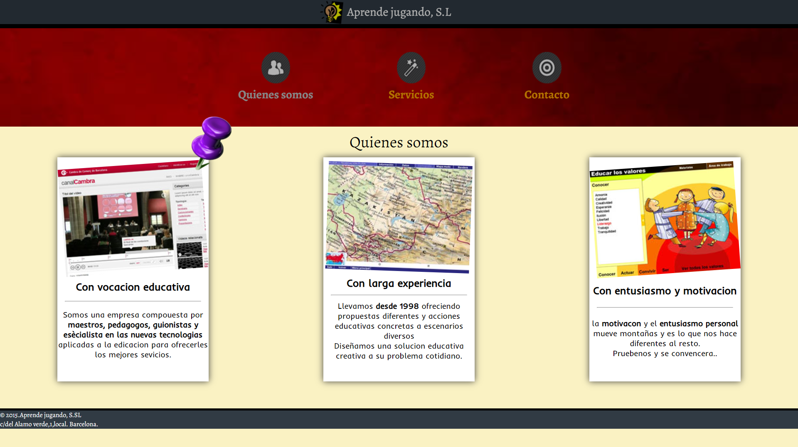

# Proyecto-cole-workshop
proyecto en el que tenemos que crear una pagina web el objetivo es aprender a hacer una pagina web
## Tecnologias usadas
IDE
<!-- visual studio code -->
<code></code>

Programas usados

<code></code>

lenguajes/frameworks usados
<!-- html -->
<code></code><!-- css -->
<code></code>

## Estado del proyecto
|             ESTADO                |             |
| -------------------------- | :----------------: | 
| Proyecto terminado           |         ✔️      | 

## Vista previa del proyecto
</img>

## Inspiracion del proyecto
Recursos dados por el profesor de la assignatura

<!-- si exite codigo sass o otros -->
## Licencia
Este proyecto está bajo la Licencia (MIT) - mira el archivo LICENSE.md para mas detalles